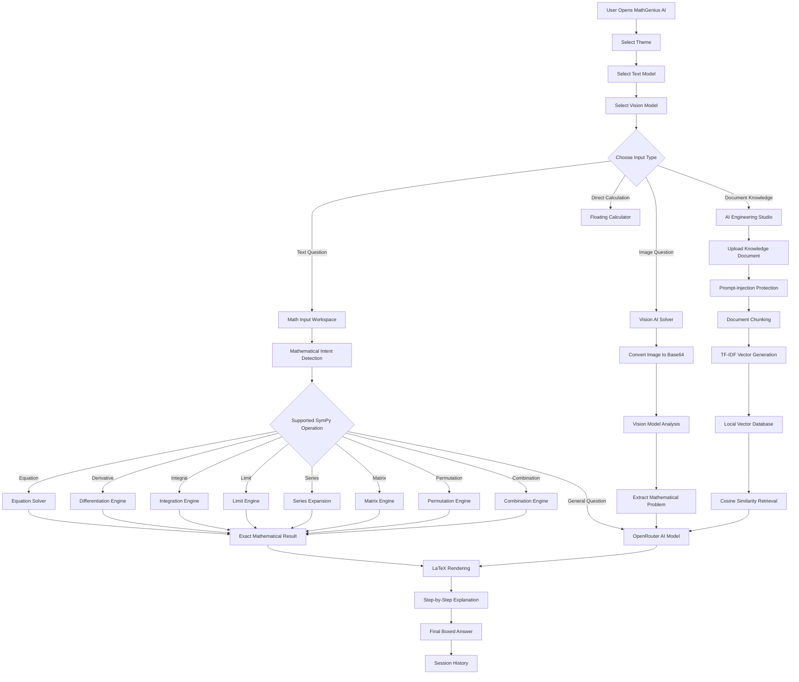
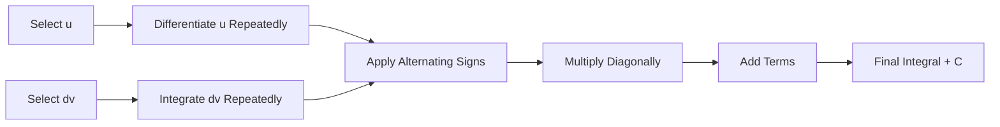
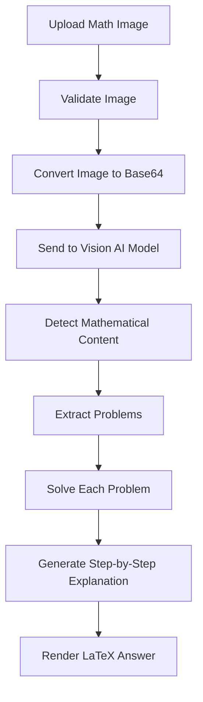

<p align="center">
  
</p>

<div align="center">

# MathGenius AI

### Advanced AI-Powered Mathematics, Symbolic Computation and Visual Problem-Solving Platform


<br>


</div>

---

## Project Preview

<p align="center">
  
</p>

<div align="center">

### White, Electric Purple and Cyan Mathematics Workspace

**AI Assistance • Symbolic Mathematics • Scientific Calculator • Vision Solver • RAG Engineering**

</div>

---

## Overview

**MathGenius AI** is an advanced artificial-intelligence-powered mathematics platform developed to solve, explain and visualize mathematical problems through a professional interactive workspace.

The platform combines the reliability of the **SymPy symbolic mathematics engine** with modern language and vision models accessed through **OpenRouter**.

It supports natural-language mathematical input, exact symbolic answers, detailed step-by-step solutions, mathematical image recognition, matrix operations, integration techniques, scientific calculations, local document retrieval and AI engineering workflows.

The application is designed for:

- Students
- Teachers
- Mathematics learners
- Researchers
- Engineers
- Data scientists
- Competitive-exam learners
- AI developers
- Educational institutions

---

## Core Capabilities

| Capability | Description |
|---|---|
| AI Mathematics Assistant | Accepts natural-language questions and returns structured mathematical explanations |
| Symbolic Computation | Uses SymPy to generate exact algebraic and calculus results |
| Equation Solver | Solves linear, quadratic, polynomial and symbolic equations |
| Derivatives | Calculates first-order and higher-order derivatives |
| Integration | Supports indefinite and definite integration |
| Tabular Integration | Provides integration-by-parts tables with alternating signs |
| Limits | Evaluates limits at finite values and infinity |
| Series Expansion | Produces Taylor and Maclaurin series |
| Expression Simplification | Simplifies complex mathematical expressions |
| Factorization | Factors algebraic and polynomial expressions |
| Expression Expansion | Expands brackets and polynomial expressions |
| Matrix Operations | Calculates determinants, inverses, eigenvalues, rank, trace and RREF |
| Permutations | Calculates arrangements using the permutation formula |
| Combinations | Calculates selections using the combination formula |
| Scientific Calculator | Includes arithmetic, scientific functions and memory operations |
| Math Keyboard | Provides mathematical symbols, operators, Greek letters and functions |
| Vision AI Solver | Reads mathematical questions from uploaded images |
| Multi-Model Routing | Allows selection of text and vision AI models |
| LaTeX Rendering | Displays professional mathematical notation |
| RAG Workspace | Retrieves relevant knowledge before generating responses |
| Local Vector Database | Uses TF-IDF vectors and cosine similarity for local retrieval |
| Fine-Tuning Builder | Generates JSONL training examples |
| Prompt-Injection Protection | Filters potentially unsafe document instructions |
| Session History | Stores solved mathematical questions during the active session |
| Light and Dark Modes | Supports professional white and neon-dark interfaces |
| Floating Calculator | Provides a draggable calculator available throughout the application |

---

## System Architecture

```text
                         User
                           │
                           ▼
                 MathGenius AI Interface
                           │
              ┌────────────┴────────────┐
              │                         │
              ▼                         ▼
       Natural-Language Input       Image Upload
              │                         │
              ▼                         ▼
        Text Model Router         Vision Model Router
              │                         │
              └────────────┬────────────┘
                           │
                           ▼
                  Mathematical Intent
                       Detection
                           │
          ┌────────────────┼────────────────┐
          │                │                │
          ▼                ▼                ▼
       SymPy Engine    OpenRouter AI     RAG Engine
          │                │                │
          │                │         Document Chunking
          │                │                │
          │                │         TF-IDF Vector DB
          │                │                │
          │                │       Similarity Retrieval
          │                │                │
          └────────────────┼────────────────┘
                           │
                           ▼
                 Structured AI Response
                           │
                           ▼
                   LaTeX Normalization
                           │
                           ▼
              Step-by-Step Math Solution
                           │
                           ▼
           History / Calculator / Downloads
```

---

## Complete Application Workflow



---

## Application Interface

The user interface uses a professional combination of:

```text
White
Electric Purple
Violet
Cyan
Dark Navy
Soft Glassmorphism
Neon Highlights
Times New Roman Typography
```

### Interface Components

```text
Professional Landing Page
AI Status Indicator
Model Routing Sidebar
Session Overview
Mathematics Workspace
Natural-Language Input
Scientific Calculator
Mathematical Keyboard
Quick-Start Examples
AI Engineering Workspace
Vision Problem Solver
Formula Reference
Matrix Tools
History Panel
Theme Controller
```

---

## Mathematics Workspace

The main Mathematics Workspace allows users to enter questions in standard mathematical notation or natural language.

### Example Inputs

```text
solve x^2 - 5x + 6 = 0
```

```text
derivative of x^3 * sin(x)
```

```text
integrate x^2 * e^x using tabular method
```

```text
limit of sin(x)/x as x approaches 0
```

```text
factor x^3 - 6x^2 + 11x - 6
```

```text
expand (x + 2)(x - 3)
```

```text
Taylor series of sin(x) order 8
```

---

## Symbolic Mathematics Engine

MathGenius AI uses **SymPy** to produce exact mathematical results.

### Supported Symbolic Operations

| Operation | Function |
|---|---|
| Solve | Finds symbolic roots and solutions |
| Differentiate | Calculates derivatives of any supported order |
| Integrate | Calculates definite and indefinite integrals |
| Simplify | Reduces expressions to simpler forms |
| Factor | Factors polynomial and algebraic expressions |
| Expand | Expands products and powers |
| Limit | Evaluates mathematical limits |
| Series | Generates Taylor or Maclaurin expansions |
| Evaluate | Calculates decimal approximations |
| Matrix | Performs advanced linear-algebra operations |
| Permutation | Calculates ordered arrangements |
| Combination | Calculates unordered selections |

---

## Equation Solver

The equation solver accepts equations with or without an explicit right-hand side.

### Example

```text
solve x^2 - 5x + 6 = 0
```

### Processing

```text
Input Equation
      │
      ▼
Parse Mathematical Expression
      │
      ▼
Create SymPy Equation
      │
      ▼
Solve for Selected Variable
      │
      ▼
Convert Result to LaTeX
      │
      ▼
Display Exact Solutions
```

### Result

```math
x = 2,\quad x = 3
```

---

## Differentiation Engine

The platform supports first-order and higher-order differentiation.

### Example

```text
derivative of x^3 * sin(x)
```

### Result Structure

```text
Problem Restatement
Method Identification
Differentiation Rule
Step-by-Step Calculation
Simplified Derivative
Boxed Final Answer
Key Mathematical Insight
```

---

## Integration Engine

MathGenius AI supports:

- Indefinite integration
- Definite integration
- Integration by substitution
- Integration by parts
- Tabular integration
- Trigonometric integration
- Exponential integration
- Polynomial integration

### Example

```text
integrate x^2 * e^x
```

---

## Tabular Integration by Parts

The platform includes a dedicated tabular integration engine.

### Tabular Structure

| Sign | Derivatives of `u` | Repeated Integrals of `dv` |
|---|---|---|
| + | Original function | First integral |
| − | First derivative | Second integral |
| + | Second derivative | Third integral |
| − | Third derivative | Fourth integral |

### Example

```text
u = x^2
dv = e^x
```

### Workflow



---

## Limits and Series

### Limits

The limit engine supports:

```text
Finite limit points
Positive infinity
Negative infinity
Symbolic expressions
Trigonometric limits
Rational-function limits
```

### Series

The series engine supports:

```text
Taylor series
Maclaurin series
Configurable expansion order
Configurable expansion point
Symbolic remainder notation
```

---

## Matrix Operations

The Matrix workspace provides advanced linear-algebra tools.

### Supported Operations

| Operation | Purpose |
|---|---|
| Determinant | Calculates the determinant of a square matrix |
| Inverse | Finds the inverse of a non-singular matrix |
| Eigenvalues | Calculates matrix eigenvalues |
| Eigenvectors | Determines eigenvector information |
| Trace | Calculates the sum of diagonal elements |
| Rank | Determines the number of independent rows or columns |
| RREF | Generates reduced row-echelon form |

### Example Matrix Input

```python
[[1, 2], [3, 4]]
```

---

## Permutations and Combinations

### Permutation Formula

```math
P(n,r)=\frac{n!}{(n-r)!}
```

### Combination Formula

```math
C(n,r)=\frac{n!}{r!(n-r)!}
```

### Example Inputs

```text
Calculate permutation of 8 objects taken 3 at a time
```

```text
Calculate combination of 10 objects taken 4 at a time
```

---

## Scientific Calculator

The built-in calculator is available through a floating action button.

### Calculator Features

```text
Basic arithmetic
Addition
Subtraction
Multiplication
Division
Percentage
Positive and negative values
Memory Clear
Memory Recall
Memory Addition
Memory Subtraction
Scientific functions
Keyboard support
Send result to math input
Draggable calculator window
```

### Scientific Functions

```text
sin
cos
tan
log
ln
square root
powers
factorial
constants
parentheses
```

---

## Advanced Math Keyboard

The mathematical keyboard allows users to insert symbols without manually typing complex syntax.

### Keyboard Categories

| Category | Included Symbols |
|---|---|
| Numbers and Basic | Numbers, arithmetic symbols, parentheses and equality |
| Powers and Roots | Square, cube, nth power, square root and cube root |
| Calculus | Integral, derivative, limit, summation and infinity |
| Trigonometry | Sine, cosine, tangent and inverse functions |
| Logarithms | Natural log, logarithms and exponential functions |
| Greek Letters | Alpha, beta, theta, sigma, lambda and omega |
| Special Symbols | Inequalities, set symbols, factorial, nPr and nCr |

---

## Vision AI Mathematical Solver

The Vision AI workspace allows users to upload an image containing mathematical questions.

### Supported Image Tasks

```text
Read handwritten mathematical expressions
Read printed mathematical questions
Identify equations
Extract mathematical symbols
Solve visible problems
Explain calculations step by step
Render answers using LaTeX
```

### Vision Workflow



---

## AI Model Routing

MathGenius AI provides independent routing for text and vision models.

### Text Models

```text
GPT-OSS 20B
LLaMA 3.3 70B
LLaMA 4 Scout
Gemini Flash
Qwen 2.5 72B
DeepSeek R1
Claude 3.5 Sonnet
GPT-4o Mini
Gemini Pro
```

### Vision Models

```text
LLaMA 4 Scout Vision
Gemini Flash Vision
GPT-4o Vision
Claude 3.5 Sonnet Vision
```

Model availability may depend on the selected OpenRouter account and current provider availability.

---

## AI Engineering Studio

MathGenius AI includes a dedicated AI Engineering workspace for document-based mathematical intelligence.

### Capabilities

```text
Document ingestion
Text extraction
Configurable chunk size
Configurable chunk overlap
Prompt-injection protection
TF-IDF vector generation
Local vector database
Cosine similarity retrieval
Retrieval-Augmented Generation
Evidence-based answers
Fine-tuning JSONL builder
Framework availability detection
```

---

## RAG Architecture

```text
                   Uploaded Knowledge
                           │
                           ▼
                     Text Extraction
                           │
                           ▼
                Prompt-Injection Protection
                           │
                           ▼
                  Overlapping Text Chunks
                           │
                           ▼
                   Tokenization and TF-IDF
                           │
                           ▼
                  Local Sparse Vector Store
                           │
                           ▼
User Question ──────► Query Vector Generation
                           │
                           ▼
                  Cosine Similarity Search
                           │
                           ▼
                   Top Relevant Chunks
                           │
                           ▼
                   Context Construction
                           │
                           ▼
                    OpenRouter AI Model
                           │
                           ▼
              Grounded Mathematical Response
```

---

## Document Chunking

The chunking engine divides uploaded content into overlapping sections.


## Local Vector Database

The application includes a dependency-free local retrieval engine.

### Vector Process

```text
Document chunks
      │
      ▼
Token extraction
      │
      ▼
Term-frequency calculation
      │
      ▼
Inverse-document-frequency calculation
      │
      ▼
Normalized TF-IDF vectors
      │
      ▼
Cosine similarity retrieval
```

This allows the RAG workspace to operate even without an external vector database.

---

## Prompt-Injection Protection

Before document content is used by the AI, the platform can inspect it for suspicious instructions.

### Examples of Potentially Suspicious Content

```text
Ignore previous instructions
Reveal hidden prompts
Override system rules
Expose API keys
Execute external commands
Act as another system
```

Documents containing suspicious instructions can be filtered, flagged or excluded from AI context.

---

## Fine-Tuning Dataset Builder

The Fine-Tuning Studio converts prompt-response examples into JSONL format.

### Use Cases

```text
Mathematics tutor fine-tuning
Domain-specific response formatting
Step-by-step solution training
Educational assistant development
LaTeX response optimization
Model-evaluation dataset preparation
```

---

## Framework Integrations

The AI Engineering Studio detects optional framework installations.

| Framework | Purpose |
|---|---|
| LangChain | LLM chains, retrievers and RAG workflows |
| LangGraph | Stateful and agentic workflow orchestration |
| LlamaIndex | Document indexing and knowledge retrieval |
| ChromaDB | Persistent vector storage |
| Sentence Transformers | Local embedding generation |
| Datasets | Fine-tuning dataset management |

The built-in local retrieval engine continues working when optional frameworks are unavailable.

---

## AI Response Format

The AI is instructed to generate structured educational answers.

### Standard Format

```text
Problem
Method
Solution
Step 1
Step 2
Step 3
Answer
Key Insight
```

### Mathematical Formatting

```text
Inline mathematics uses $...$
Display mathematics uses $$...$$
Fractions use \frac{}{}
Square roots use \sqrt{}
Integrals use \int
Derivatives use \frac{d}{dx}
Final answers use \boxed{}
```

---

## LaTeX Rendering Engine

MathGenius AI includes a custom markdown and KaTeX-compatible rendering layer.

### Rendering Features

```text
Inline LaTeX
Block LaTeX
Equation normalization
Escaped HTML
Markdown headings
Bold text
Code blocks
Tables
Ordered lists
Unordered lists
Responsive mathematical blocks
```

---

## Session Overview

The sidebar displays live workspace information.

### Session Metrics

```text
Number of chats
Number of solved problems
Selected text model
Selected vision model
AI connection status
Recent mathematical history
```

Users can clear active session information through the sidebar controls.

---

## Quick-Start Examples

The application provides example buttons for commonly used mathematical tasks.

```text
Integrate x²eˣ using the tabular method
```

```text
Find the derivative of x³sin(x)
```

```text
Solve x³ - 6x² + 11x - 6 = 0
```

Selecting an example automatically loads it into the mathematical input field.

---

## Technology Stack

| Layer | Technologies |
|---|---|
| Programming Language | Python |
| Frontend Framework | Streamlit |
| Symbolic Mathematics | SymPy |
| AI API Gateway | OpenRouter |
| Text Models | GPT-OSS, LLaMA, Gemini, Qwen, DeepSeek and Claude |
| Vision Models | LLaMA Vision, Gemini Vision, GPT-4o and Claude |
| Image Processing | Pillow |
| HTTP Communication | Requests |
| Mathematical Rendering | LaTeX and KaTeX |
| Local Retrieval | TF-IDF and cosine similarity |
| RAG Framework | LangChain |
| Agent Orchestration | LangGraph |
| Document Indexing | LlamaIndex |
| Vector Database | ChromaDB |
| Local Embeddings | Sentence Transformers |
| Fine-Tuning Data | Hugging Face Datasets and JSONL |
| Interface Design | HTML, CSS and JavaScript |
| Typography | Times New Roman |
| Icons | Material Symbols |
| Theme | White, Electric Purple and Cyan |

---

## Project Structure

```text
MathGenius-AI/
│
├── math_chatbot.py
├── requirements_v3.txt
├── requirements_ai.txt
├── README.md
├── calculator_visible.png
├── .env
├── .gitignore
│
├── assets/
│   ├── screenshots/
│   ├── icons/
│   └── documentation/
│
├── data/
│   ├── knowledge_documents/
│   ├── vector_index/
│   └── fine_tuning_examples/
│
└── logs/
    ├── streamlit_ui_test.out.log
    └── streamlit_ui_test.err.log
```

---
---

## Important Notice

MathGenius AI combines deterministic symbolic computation with generative artificial intelligence.

SymPy-generated results are based on mathematical computation. AI-generated explanations may still require verification for complex, ambiguous or high-stakes problems.

Always verify important academic, engineering or research results independently.

---

## Developer

### Snehal Laxman Jadhav

**AI Engineer | Python Developer | Generative AI | LangChain | LangGraph | RAG | Symbolic Mathematics**

---

## License

This project is available under the **MIT License**.

You may use, modify and distribute the application for educational, personal and commercial purposes according to the license terms.

---

<div align="center">

## Think Mathematically. Solve Intelligently.

Built with:

**Python • Streamlit • SymPy • OpenRouter • LangChain • LangGraph • LlamaIndex • ChromaDB • Pillow • LaTeX**

<br>


<br><br>

© 2026 **Snehal Laxman Jadhav**

</div>

<p align="center">
  
</p>
